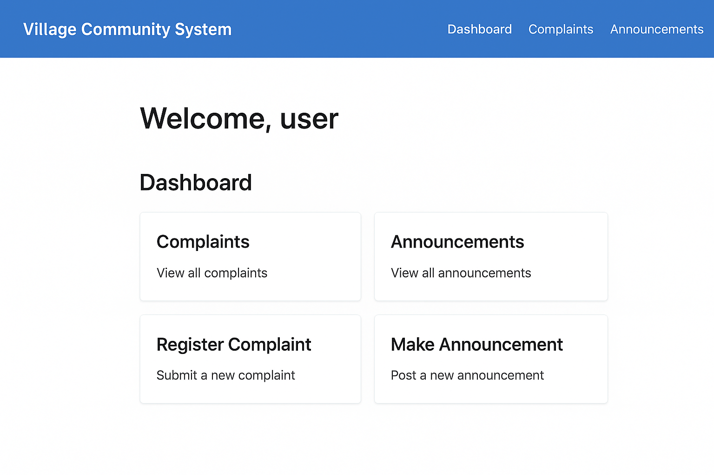

# 🌾 Village Community Management System  
A complete **Java + JSP + Servlet + PostgreSQL** based web application designed for village administration, citizen services, announcements, and record management.

---

## 🚀 Features
- ✔ Citizen Registration & Login  
- ✔ Admin Dashboard  
- ✔ Village Announcements  
- ✔ Family & House Information  
- ✔ Government Scheme Updates  
- ✔ Clean UI with JSP Pages  
- ✔ JDBC + PostgreSQL Backend  
- ✔ Secure Authentication (Servlets)

---

## 🛠️ Tech Stack & Badges

  
  
  
  
  

---

# 🖼️ Project UI Screenshots

## 🔷 1. **Login Screen**

---

## 🔷 2. **Register Screen**

---

## 🔷 3. **Admin / Dashboard**

---

# 📂 Folder Structure

